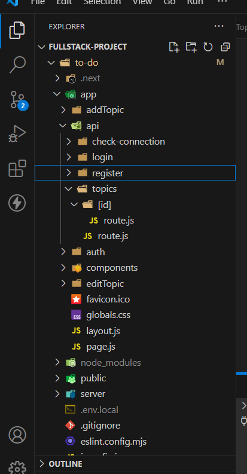
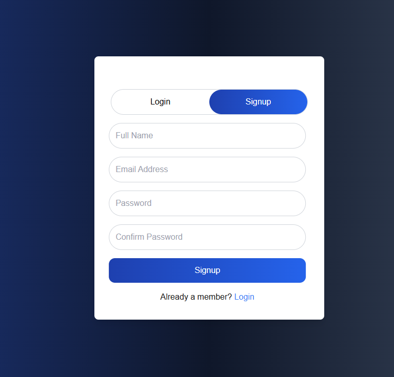
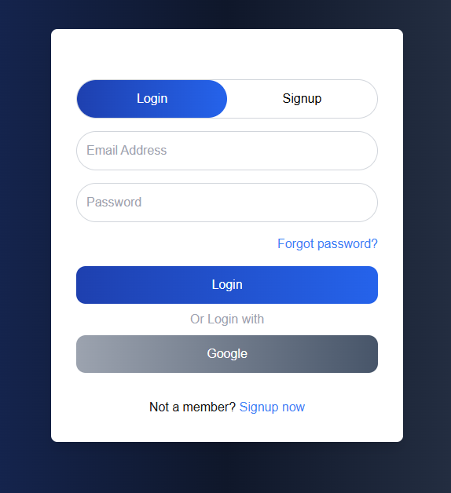
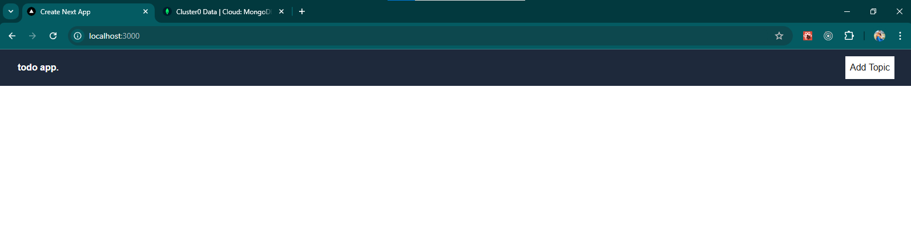
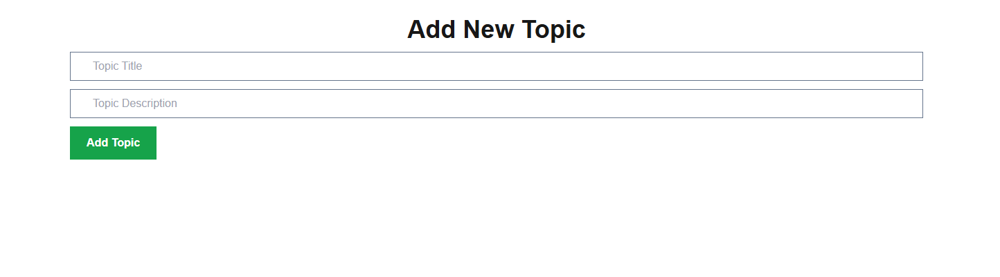
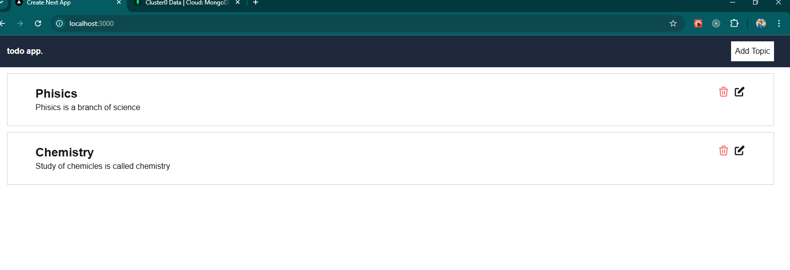
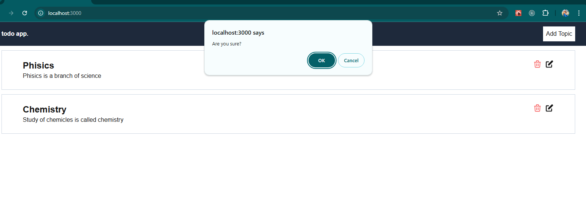
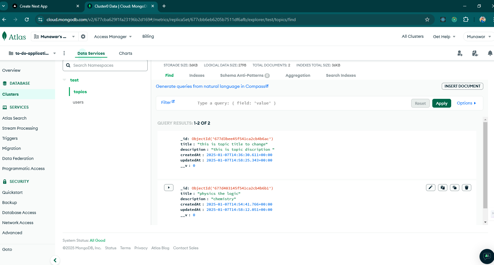
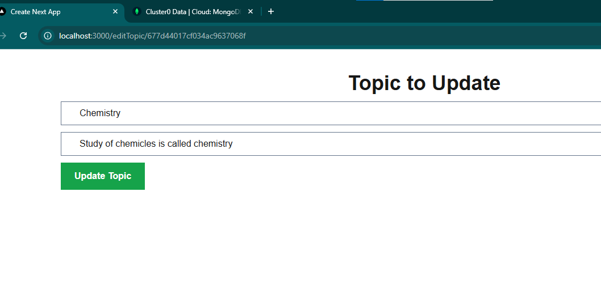

 
## Getting Started

First, run the development server:

```bash
npm run dev
# or
yarn dev
# or
pnpm dev
# or
bun dev
```

Open [http://localhost:3000](http://localhost:3000) with your browser to see the result.

 <!-- ============================= -->
 📝 Full-Stack Todo App with Next.js and MongoDB

🚀 Overview

This is a Full-Stack Todo Application built using Next.js for the frontend and backend, with MongoDB as the database. The app features user authentication using JWT and bcrypt for secure password handling. Middleware is implemented to protect routes, ensuring only authenticated users can add, edit, or delete tasks.
<!-- ============================= -->
📚 Key Features

User Authentication: Secure login and registration with password hashing using bcrypt and token generation with JWT.

Protected Routes: Utilized Next.js Middleware to restrict access to task management routes.

CRUD Operations: Authenticated users can add, edit, and delete their tasks.

Dynamic Updates: Real-time UI updates without page refresh using Next.js features.

Responsive Design: Optimized for mobile, tablet, and desktop devices.
<!-- ============================= -->
🛠️ Tech Stack

Frontend: Next.js

Backend: Next.js API Routes

Database: MongoDB

Authentication: JWT & bcrypt

Styling: Tailwind CSS
<!-- ============================= -->

🔑 Authentication Workflow

User Registration: Passwords are hashed using bcrypt.

Token Generation: JWT tokens are generated upon successful login.

Route Protection: Middleware checks for valid tokens to allow access.


<!-- ============================= -->
 API Routes

POST /api/auth/register: Register a new user.

POST /api/auth/login: Login a user.

GET /api/topics: Fetch all tasks.

POST /api/topics: Add a new task.

PUT /api/topics: Update an existing task.

DELETE /api/topics: Delete a task.

<!--  -->

FOLDER STRUCTURE 


Register Page


SignIn Page


HOME PAGE WITHOUT ANY TASK 


ONCLICKING ADD TASK BUTTON 


After adding some task UI will look like 


Onclicking Delecte button 


MongoDb Database


Update UI

